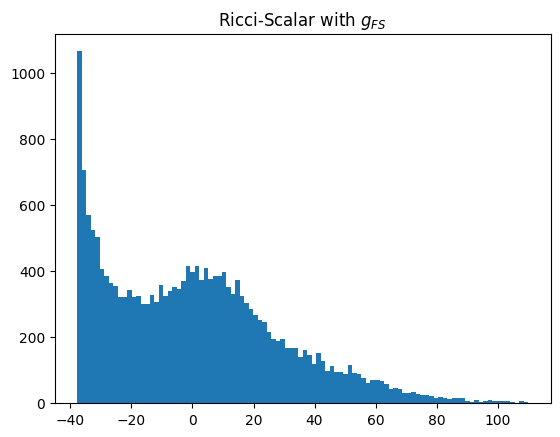
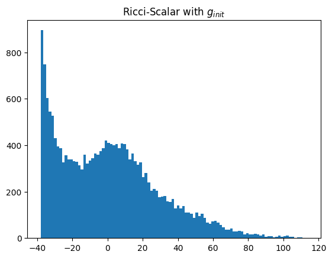
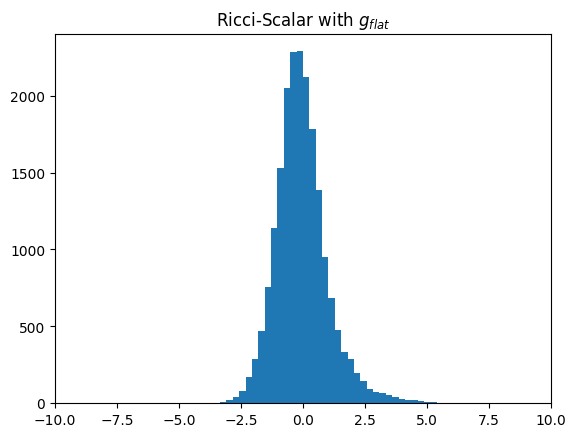

# jax_metric_CalabiYau
 
Some python code written in JAX for finding Ricci-flat metrics on Calabi-Yau manifolds.

An example can be found in example.ipynb, which can be used to find the metric on both the tetraquadric and quintic with some pre-generated points. This is modular, and can also be applied to any codimension-1 CICY, but new neural network architectures will needeed to be written. The method is equivalent to the phi-model introduced in cymetric but with projective neural networks that automatically satisfy the transition loss criteria.

## Using this for yoyr own research
This was written mostly for my own amusement, as I wanted something, unlike the alternatives, in a functional programming paradigm. My hope being that this would maximise clarity, over speed, for someone who is more familar with the mathematics than the computational methods. As such, I've used this when introducing mathematicians and physicists to numerical geomtry. For research purposes, I suggest useing either https://github.com/pythoncymetric/cymetric or https://github.com/Justin-Tan/cymyc which are both more generic.